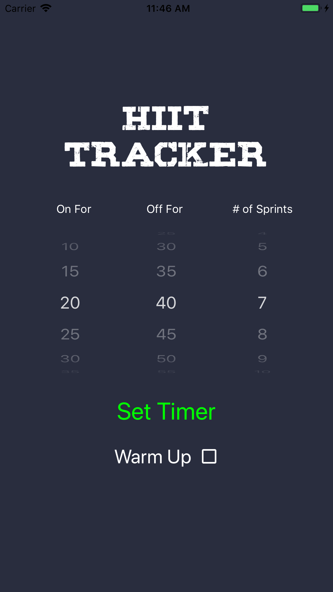
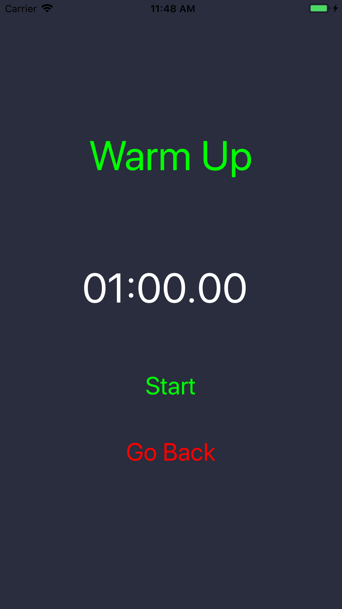
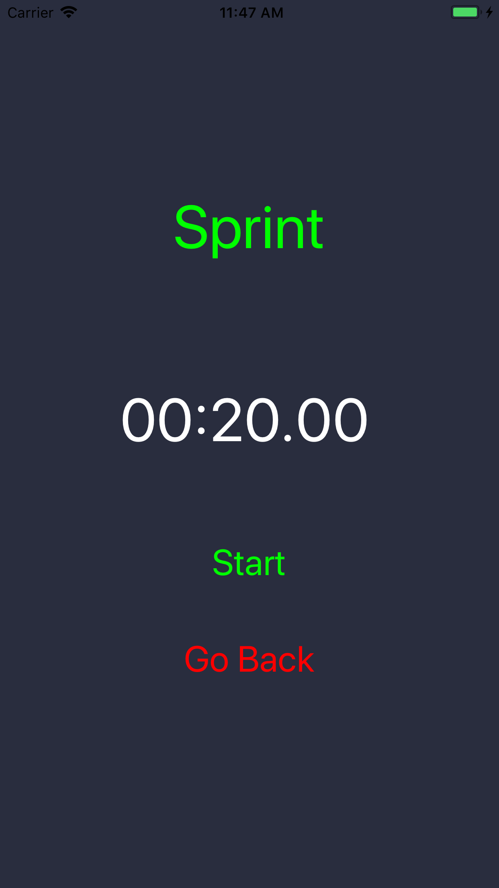
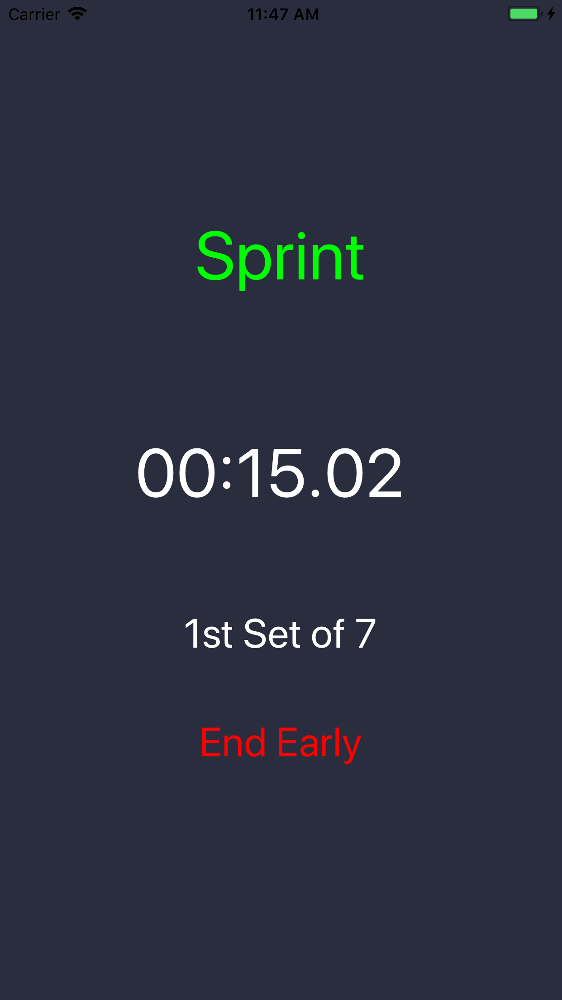
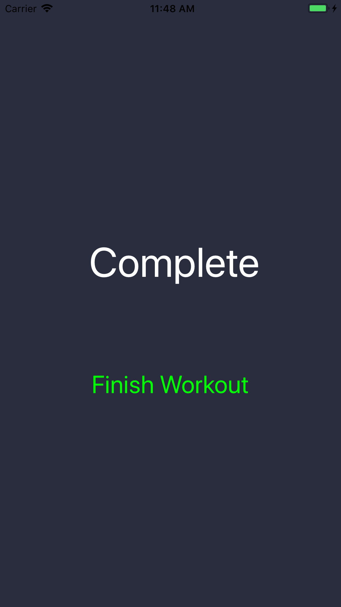

# HIITTracker

<!-- 



 -->

  
  
  
  
  

## Available Scripts

Helpful script to run the project

### `npm start`

Runs your app in development mode.

Open it in the [Expo app](https://expo.io) on your phone to view it. It will reload if you save edits to your files, and you will see build errors and logs in the terminal.

Sometimes you may need to reset or clear the React Native packager's cache. To do so, you can pass the `--reset-cache` flag to the start script:

```
npm start --reset-cache
# or
yarn start --reset-cache
```

#### `npm test`

Runs the [jest](https://github.com/facebook/jest) test runner on your tests.

#### `npm run ios`

Like `npm start`, but also attempts to open your app in the iOS Simulator if you're on a Mac and have it installed.

#### `npm run android`

Like `npm start`, but also attempts to open your app on a connected Android device or emulator. Requires an installation of Android build tools (see [React Native docs](https://facebook.github.io/react-native/docs/getting-started.html) for detailed setup). We also recommend installing Genymotion as your Android emulator. Once you've finished setting up the native build environment, there are two options for making the right copy of `adb` available to Create React Native App:
